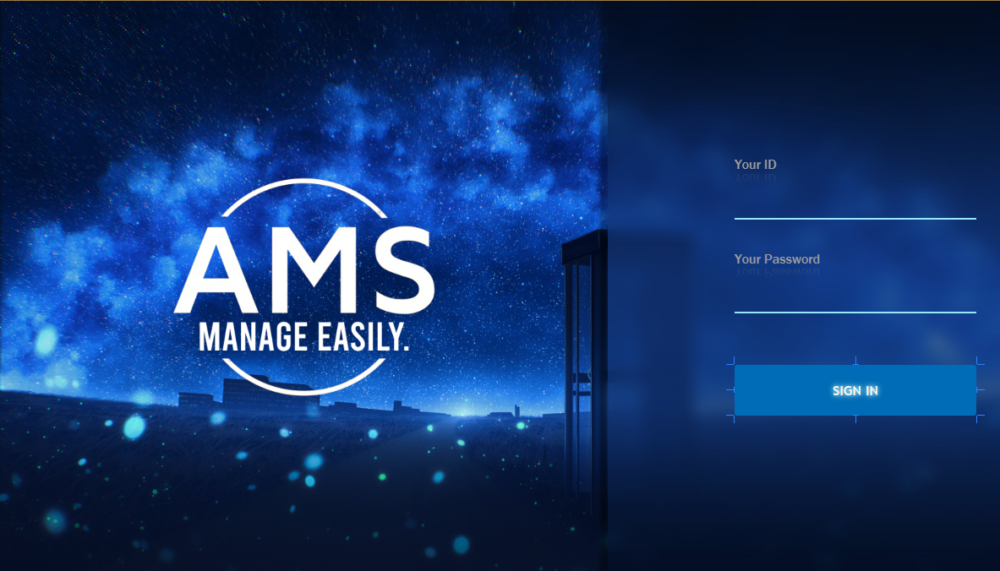
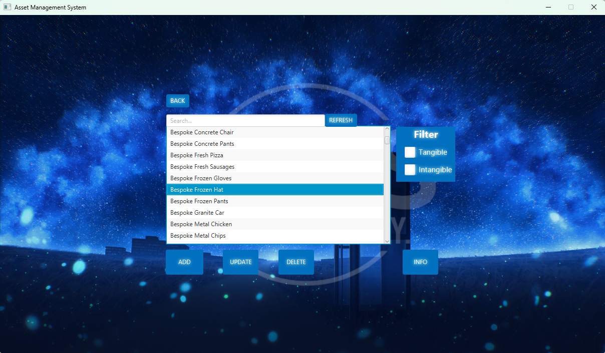

# 🏢 Enterprise Asset Management System (AMS)


A comprehensive, multi-phase Asset Management System (AMS) engineered to track, analyze, and categorize organizational assets. Built with a robust **JavaFX** desktop client and a highly normalized **MySQL** relational backend, this system manages complex asset lifecycles, real-time historical tracking, and risk compliance.

---

## 🚀 Project Overview

Developed to eliminate fragmented tracking, AMS unifies asset acquisition, maintenance, depreciation, and disposal processes into a single, scalable ecosystem. It provides tailored interfaces for IT managers, financial officers, and risk analysts.

- **Phase 1 & 2:** Enhanced Entity-Relationship (E/R) database design, categorizing assets strictly into _Tangible_ and _Intangible_ classifications.
- **Phase 3:** Full backend logic implementation, real-time analytics generation, historical data charting, and deployment.

---

## 🖥️ Application Interface (UI Showcase)

<table align="center">
  <tr>
    <td align="center">
      
      <br>
      <sub><b>Fig 1:</b> Secure Authentication Interface</sub>
    </td>
    <td align="center">
      
      <br>
      <sub><b>Fig 2:</b> Advanced Search & Dynamic Filtering</sub>
    </td>
  </tr>
  <tr>
    <td align="center">
      
      <br>
      <sub><b>Fig 3:</b> Real-time Historical Data Analytics & Information</sub>
    </td>
    <td align="center">
      
      <br>
      <sub><b>Fig 4:</b> Asset Management</sub>
    </td>
  </tr>
</table>

---

## ⚙️ Core Features & Capabilities

### 1. Centralized Asset Tracking & Categorization

- **Strict Classification:** Dynamic management of assets split logically into **Tangible** (e.g., hardware, properties) and **Intangible** (e.g., software licenses, IP).
- **Real-Time Synchronization:** Complete CRUD operations with real-time UI updates utilizing JavaFX `ObservableList`.

### 2. Asset Lifecycle & Historical Analytics

- **Lifecycle Management:** Tracks assets from initial acquisition, monitoring current value, depreciation, and final disposal.
- **Data Visualization:** Implements JavaFX `LineChart` and `XYChart` to visualize time-series historical transaction records (`hrecordtangible` / `hrecordintangible`), allowing managers to seamlessly analyze value fluctuations.

### 3. Risk & Compliance Management

- Built-in functionalities to monitor asset compliance gaps, manage operational risks, and ensure regulatory adherence based on user-defined statuses.

---

## 🏗️ System Architecture & Tech Stack

- **Language:** Java (JDK 11+)
- **Frontend UI:** JavaFX (FXML / Controller MVC Architecture)
- **Database:** MySQL (Relational Schema based on Enhanced E/R Diagrams)
- **Database Connectivity:** JDBC with `PreparedStatement` implementation to proactively prevent SQL injection vulnerabilities.

### Database Schema Highlights

The database (`ams1`) is highly normalized and utilizes foreign key constraints to maintain data integrity across:

- `asset` _(Base table for core asset metadata)_
- `tangibleasset` & `intangibleasset` _(Inherited properties like Expense vs. Interest)_
- `hrecordtangible` & `hrecordintangible` _(Time-series historical transaction logs)_

---

## 🛠️ Setup & Installation

### Prerequisites

- Java Development Kit (JDK) 11 or higher
- JavaFX SDK
- MySQL Server (running locally on port `3306`)
- MySQL JDBC Connector (`mysql-connector-java`)

### Database Configuration

1. Initialize a local MySQL database named `ams1`.
2. Execute the provided SQL schema scripts (located in the `/sql` directory) to generate tables and relationships.
3. Update the database credentials in the Controller files (e.g., `AssetSearch.java`, `LoginScreen.java`) if your local MySQL instance does not use the default `root` configuration:

```java
final String DB_URL = "jdbc:mysql://localhost:3306/ams1";
final String USERNAME = "your_username";
final String PASSWORD = "your_password";
```

### Running the Application

Launch the system by running the main entry point via Maven:

```bash
mvn javafx:run
```

_(Or execute `HelloApplication.java` directly from your preferred IDE)._
